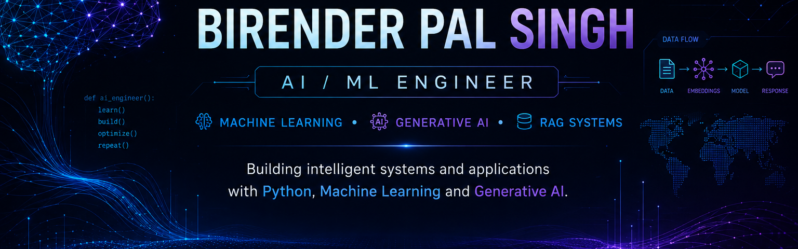

⚡ SYSTEM STATUS

<table>
<tr>
<td width="50%">

🟢 CURRENTLY BUILDING

AI Document Intelligence Platform

Exploring intelligent document processing, retrieval-augmented generation, and LLM-powered applications.

</td>

<td width="50%">

🧠 CURRENTLY EXPLORING

Generative AI · RAG · LLM Systems

Building practical AI applications while strengthening my understanding of AI engineering.

</td>
</tr>
</table>

👨‍💻 ABOUT ME

I'm an AI/ML enthusiast focused on building practical intelligent systems.

My current interests span Machine Learning, Generative AI, RAG applications, Python backend development, and data-driven solutions.

I enjoy turning concepts into working applications and continuously improving my engineering skills through hands-on projects.

Machine Learning
       ↓
Data & NLP
       ↓
Applied Machine Learning
       ↓
Generative AI
       ↓
RAG Systems
       ↓
AI Engineering

🧬 TECH STACK

🧠 AI / MACHINE LEARNING

🤖 GENERATIVE AI

⚙️ BACKEND & APPLICATIONS

🗄️ DATA & DATABASES

☁️ ENGINEERING & CLOUD

🚀 FEATURED PROJECTS

A selection of projects representing my journey from Machine Learning fundamentals toward AI engineering and Generative AI.

<table>
<tr>

<td width="50%" valign="top">

🧠 AI Document Intelligence

RAG · LLMs · Python · FastAPI · Streamlit

An intelligent document-processing platform designed to retrieve relevant information from uploaded documents and generate context-aware responses.

Status: IN DEVELOPMENT

</td>

<td width="50%" valign="top">

⚙️ ML-Hub

Machine Learning · Python · Backend · Docker

A machine-learning focused platform for experimentation, model development, and application building.

Status: ACTIVE

 

<a href="https://github.com/Birender2004/ML-Hub">
View Repository →
</a>

</td>

</tr>

<tr>

<td width="50%" valign="top">

📱 WhatsApp Chat Analyzer

Python · Data Analysis · NLP

An application for analyzing WhatsApp chat data and extracting useful statistics and insights.

Status: COMPLETED

 

<a href="https://github.com/Birender2004/WhatsApp-Chat-Analyzer">
View Repository →
</a>

</td>

<td width="50%" valign="top">

🛡️ SMS Spam Classifier

NLP · TF-IDF · Naive Bayes · Docker

A machine-learning application that classifies SMS messages as spam or legitimate using NLP techniques.

Status: COMPLETED

 

<a href="https://github.com/Birender2004/sms-spam-classifier">
View Repository →
</a>

</td>

</tr>

<tr>

<td width="50%" valign="top">

📚 Book Recommender System

Python · Machine Learning · Recommendation Systems

A recommendation application that generates book recommendations based on user preferences and similarity between items.

Status: COMPLETED

 

<a href="https://github.com/Birender2004/Book-Recommender-System">
View Repository →
</a>

</td>

<td width="50%" valign="top">

🎬 Movie Recommender System

Python · Machine Learning · Recommendation Systems

A machine-learning based recommendation application for discovering movies based on similarity and user preferences.

Status: COMPLETED

 

<a href="https://github.com/Birender2004/Movie-Recommender-System">
View Repository →
</a>

</td>

</tr>
</table>

🧭 AI / ML JOURNEY

┌──────────────────────┐
│  ML FUNDAMENTALS     │
└──────────┬───────────┘
           ↓
┌──────────────────────┐
│  DATA & NLP          │
└──────────┬───────────┘
           ↓
┌──────────────────────┐
│  APPLIED ML          │
└──────────┬───────────┘
           ↓
┌──────────────────────┐
│  GENERATIVE AI       │
└──────────┬───────────┘
           ↓
┌──────────────────────┐
│  RAG SYSTEMS         │
└──────────┬───────────┘
           ↓
┌──────────────────────┐
│  AI ENGINEERING      │
└──────────────────────┘

🎯 ENGINEERING FOCUS

▸ Retrieval-Augmented Generation
▸ LLM-powered applications
▸ Document Intelligence
▸ Machine Learning systems
▸ Natural Language Processing
▸ Python backend development
▸ SQL & data processing
▸ APIs & application development
▸ Cloud & containerized applications

📊 GITHUB ACTIVITY

 

🏆 ACHIEVEMENTS

🎓 Building a strong foundation in Machine Learning and Generative AI

🚀 Developing practical AI/ML applications

🧠 Exploring RAG and LLM-based systems

💻 Continuously improving software engineering and backend skills

📫 CONNECT WITH ME

 

BUILD → LEARN → IMPROVE

Turning AI concepts into practical systems.

 

Let's build something intelligent.

